# --- Bamazon using Node and MySQL ---
---
## Node modules used in this project:
* #### dotenv
* #### inquirer
* #### mysql
* #### chalk
* #### colors
---
# General Instructions
___
## Requirements for this node application:
* Node installed
* NPM installed
* MySQL Database Server installed
* Software to interact with database such as MySQL Workbench or Sequel Pro for Mac
* Create a .env file to save database information
___
#### To install and use yourself you will need to clone the git folder to your hard drive. Then create a database in your MySQL database and name it "bamazon"

#### You can then use the .sql files provided to add the 'products' and 'departments' tables to this database.

#### First before running any of the node files please run
```
npm install
```
### For the .env file you will need to have 4 pieces of information:
```
DB_HOST='DATABASE ADDRESS' such as localhost
DB_USER='USERNAME HERE'
DB_PASS='DATABASE PASSWORD GOES HERE'
DB_NAME='bamazon' -- database used is bamazon
```
___
# Here are some images showing the overall process once installed:
## Bamazon Customer:
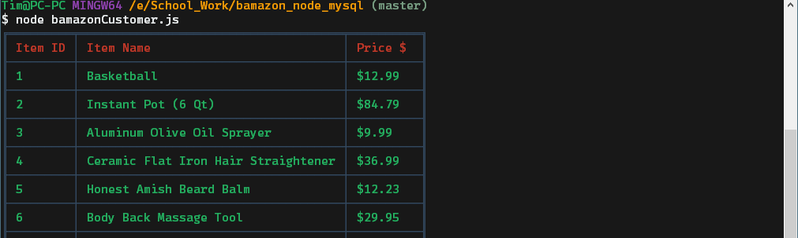
#### Here we have started the bamazonCustomer.js file. The first thing that happens is all of the items available for purchase are show in a table from the database.
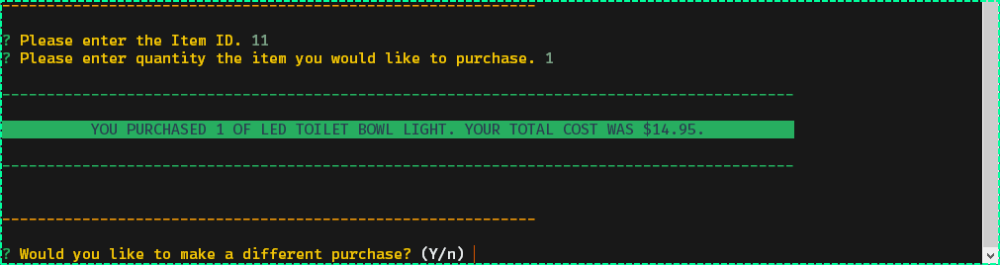
#### You are then prompted to enter in an Item ID. You can get this from the table that is printed at the first run of the file.
#### You are then prompted to enter in the quantity of the item you would like to purchase.
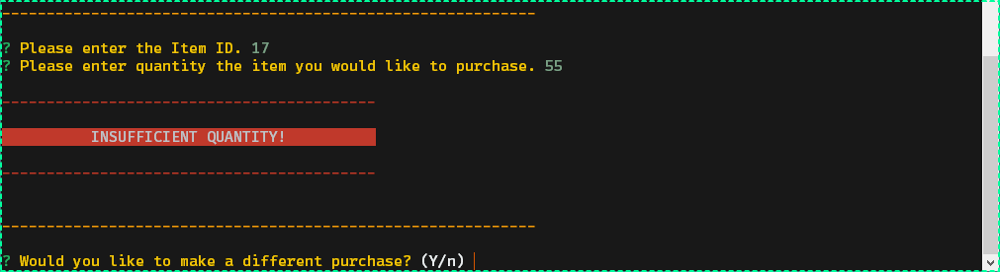
#### If there arent enough items in the quantity that you specific then a log will show you that theres an insufficient quantity and you will be asked if you would like to make another transaction.
___
## Bamazon Manager:
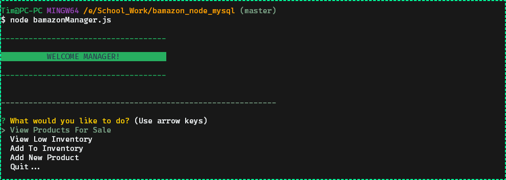
```
? What would you like to do? (Use arrow keys)
>View Products For Sale
View Low Inventory
Add To Inventory
Add New Product
Quit...
```
#### Here we see the manager welcome screen. Along with 5 options to choose from

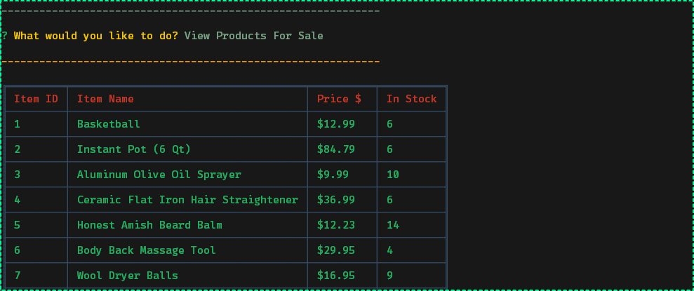
#### Much like the customers view of the managers View Products For Sale prompt will show the manager a table of all the products available for sale, but unlock the customer view the manager is able to see stock quantity of each item.

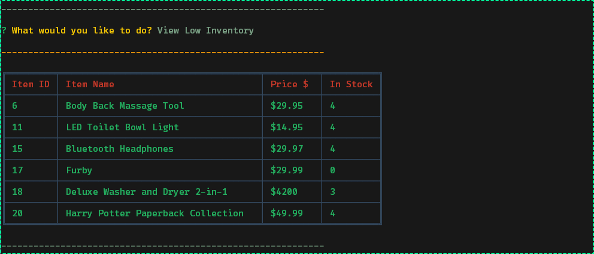
#### Manager Low Inventory prompt will show the manager all items that have a stock quantity lower than 5.

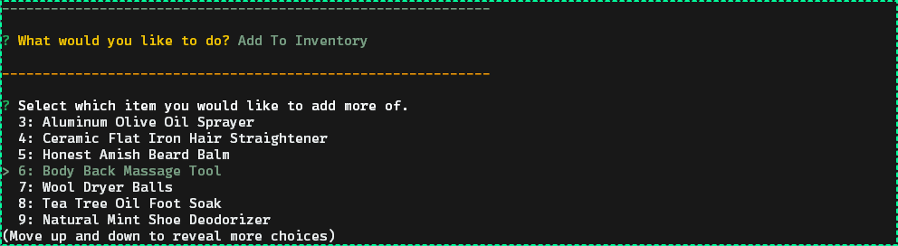
#### When add inventory is selected you are given a list of all items to choose from. Once the item is selected you can then enter in the quantity you wish to stock...

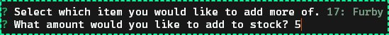
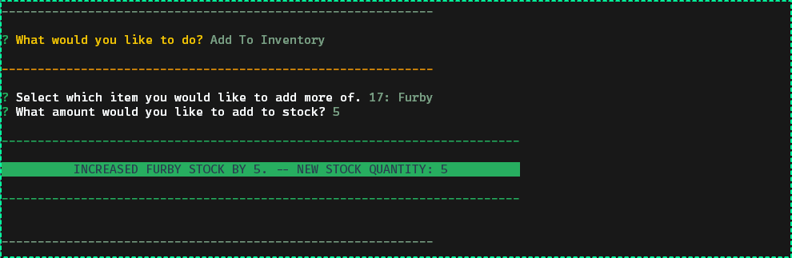
#### This shows a log out showing you that the correct item was added with the amount specified in the quantity prompt.

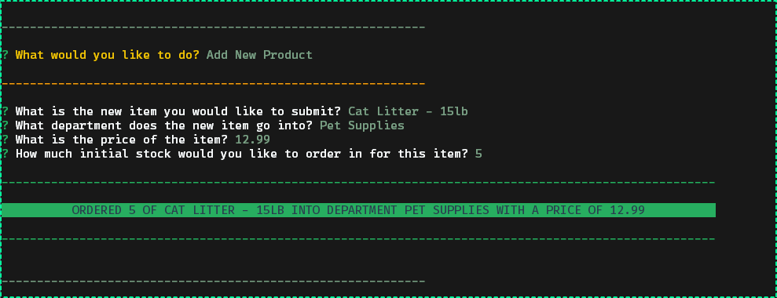
#### Then when the manager selects Add New Product there are a series of prompts requesting information on the new item to be add.
#### Once the manager has answered all prompts then the item is added to the database and a logged out message is shown letting the manager know what was added.
___
## Bamazon Supervisor:
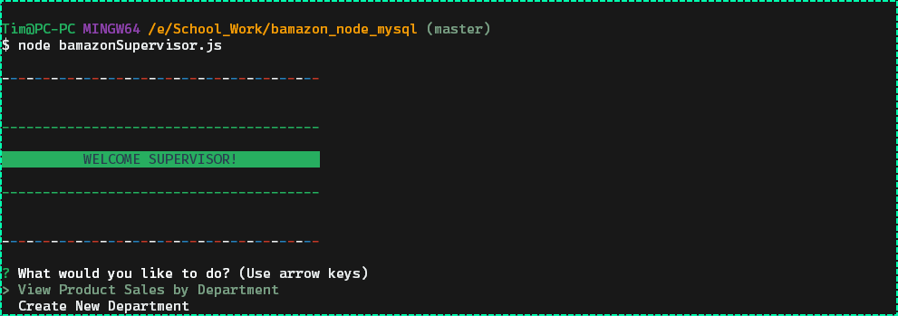
#### Here we see the Supervisor welcome screen. Since the supervisor is so much more important(yeah, right...) they get a special welcome menu with fancier colors.
#### You then choose either View Product Sales by Department or Create New Department to proceed.

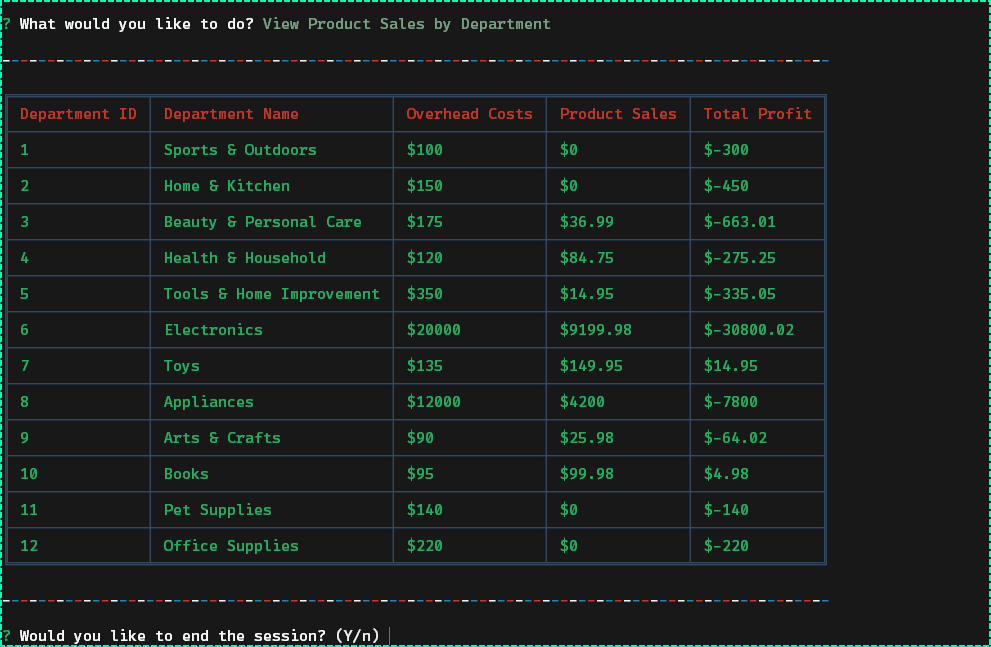
#### View Product Sales by Department will print out a table showing all departments with their ID, Name, Overhead Costs, Sales, and total profit.

#### Total profit is calculated using Overhead costs from departments table and product sales from the products table. These are then summed to get the total profit using a mysql join method.

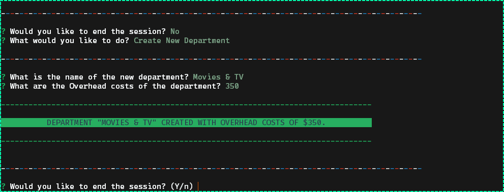
#### Here we see the Create New Department functionality. When selected the supervisor is prompted with two questions. They are asked to enter a department name for the new department. Then they set the overhead costs of the department.
#### The supervisor will then see a logged message showing the name of the department added along with overhead costs.

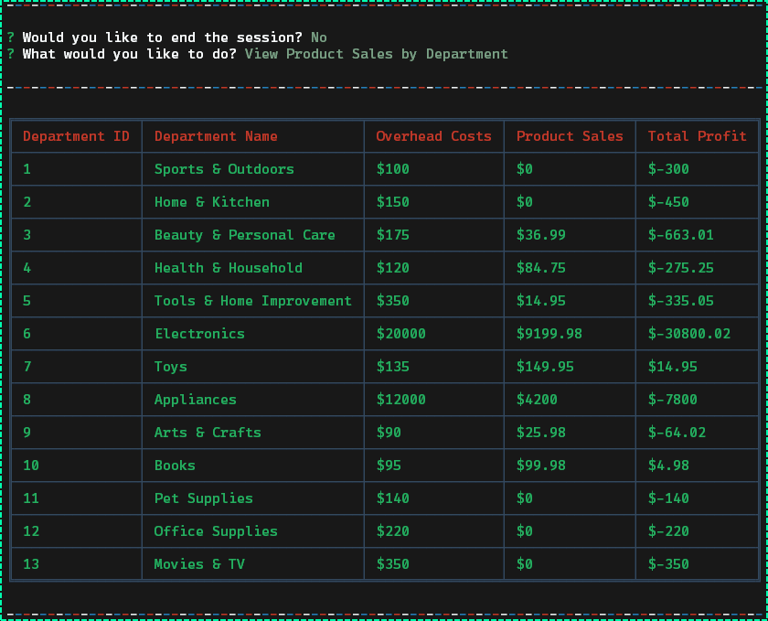

#### And if we run View Product Sales by Department again we see that the new department was added. There are no new product sales in this department as it was just added. The manager will have to go in and order a new item to stock for that department!
___

## Hopefully you've enjoyed my Node and MySQL application for the Bamazon Store!